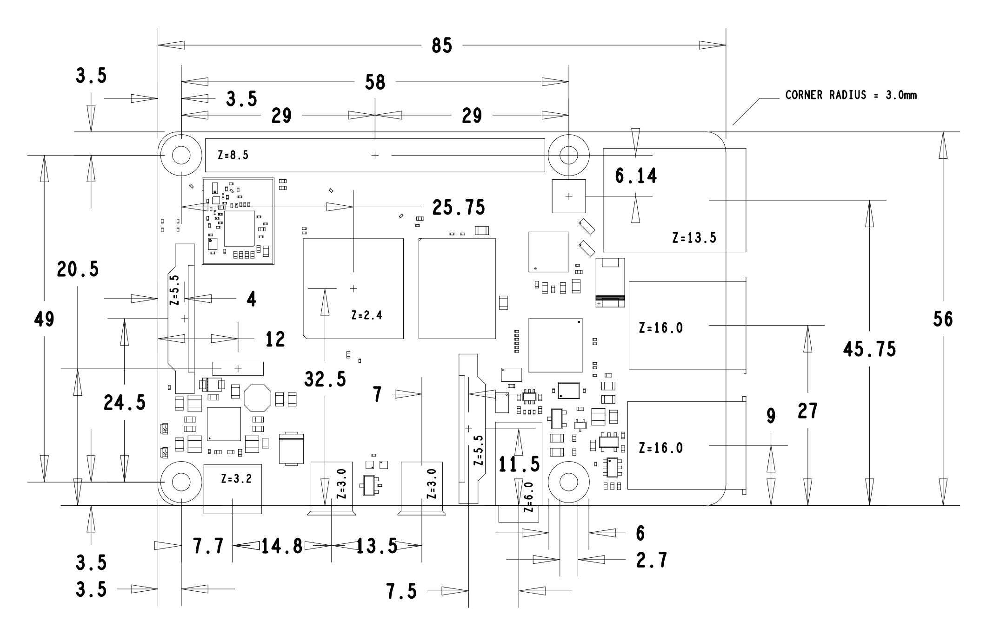

# Overview

The objective here is a ts-dash (see http://tunerstudio.com/index.php/products/ts-dash) replacement for the instrument clocks, using the standard E30 wiring.

We use a raspberry pi and lcd touch screen, and custom 3d printed dash cluster.

## Pins

https://www.e30zone.net/e30wiki/images/b/b2/Instrument_Cluster.pdf

## Cluster connectors

There is an stl file for the connector (tested with blue) in the stls folder. Basically it looks like below and the blue connector fits perfectly. The pins themselves are just bent dupont connectors fixed in place with a hot glue gun. Seems to work. At time of writing, more work is needed to get the locking tab to do it's job, but it certainly isn't loose.

Direct serial over the dash connectors is a non starter as pi uses 3.3v arduino uses 5v. If I can find another connection I can go via the usb plugs but can only find 3 ECU pinouts / Dash connectors

## C1 (Blue)
26 Pins

- 7 Tachometer (now fuel level to speeduino)
- 11 Fuel flow rate ~~(now Speeduino USB serial data RX from Motronic pin 32) to Pi 8 TX - Yellow~~
- 14 Alternator light +
- 16 Alternator lights -
- 18 Oil  
- 20 GND
- 23 Live 12v

## C2 (White)
26 Pins

- 4 Fuel tank sender
- 5 Fuel tank low light
- 8 Speed sensor switching
- 12 Speed sensor 
- 22 Check Light ~~(now Speeduino USB GND from Motronic pin 16) to Pi~~

## Diagrams

## Pi

## Internal cover connector

The cluster is made up of the main cluster and a cover. The cover has the 2 (blue and white) connectors for the BMW connectors. We use a 40 pin IDC to connect the cover to the main cluster. This is the wiring diagram for this mini loom below:

IDC Pin - Source - Description

1 - Blue 7 - Fuel level (from White 4)
3 - Blue 23 - Switched power +
4 - Blue 20 - Switched power -
6 - Blue 20 - Fuel lo light -
7 - Blue 16 - Batt light -
10 - lue 14 - Batt light +
11 - White 22 - Check Light 
14 - White 12 speed sensor
15 - White 5 - Fuel low light +
17 - White 4 - Fuel level (to Blue 7)

TBC
? - O2 diagnostic - O2 led
? - Can high - car pi hat
? - Can low - car pi hat

## Power during cranking

The Diode: This must be a high-current Schottky blocking diode (rated for at least 5A–10A, such as a 10SQ045 or 10A10). Its job is to let power flow from the car battery into the supercapacitor and CarPiHAT, but prevent the supercapacitor from discharging backward into the car's starter motor during cranking.

The Supercapacitor Bank: This acts as a massive energy reservoir. When the car battery voltage drops during cranking, the capacitor steps in and feeds its stored 12V power to the CarPiHAT.

You will insert the diode and the supercapacitor bank only on the 12V BAT line (this comes in our case from one of the accessory switches on the centre console). Do not put them on the 12V ACC line, as the CarPiHAT needs to see the ACC line drop immediately to sense the ignition state.

                [ In-line Fuse ]      [ Schottky Diode ]
Car Battery 12V (+) ----[ 5A ]-------------[>|]--------+--------> CarPiHAT 12V BAT Pin
                                            Anode   Cathode    |
                                                               |
                                                          +--------+

                                                          |  (+)   |
                                                          | 16V 83F| Supercapacitor
                                                          |  (-)   | Bank
                                                          +--------+
                                                               |
Car Chassis Ground (-) ----------------------------------------+--------> CarPiHAT GND Pin

-----------------------------------------------------------------------------------------
Car ACC Switched 12V (via dash plug) ---------------------------------------------------> CarPiHAT 12V ACC Pin
