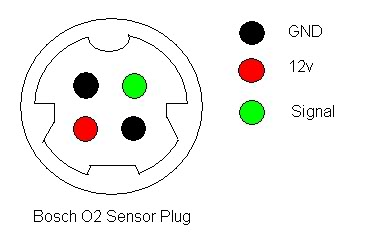

# Lambda
- Car wiring colour - purpose - Motronic pin - Bespoke loom pin no. - Bespoke loom wire colour
- Black - Signal - Motronic pin 28 - 2 - Green
- White - Heater - Fuel pump live relay - 6 - Red
- Gray - Signal Ground - Motronic pin 10 - 5 - Black
- Gray - Heater Ground - ECU Loom ground - 3 - White

## Bespoke lambda loom

- Pin no. - Colour - Purpose - Connects to
- 1 - Blue - LED diagnostic - nothing right now
- 2 - Green - Signal - Car side green
- 3 - White - Heater ground - Car side Gray (chassis ground)
- 4 - Brown - Narrow band signal - unused
- 5 - Black - Signal ground - Car side Gray (o2 signal ground motronic pin 10)
- 6 - Red - Fused Live - Car side red

